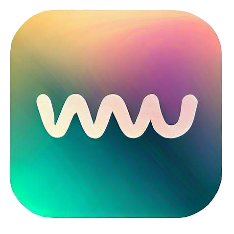
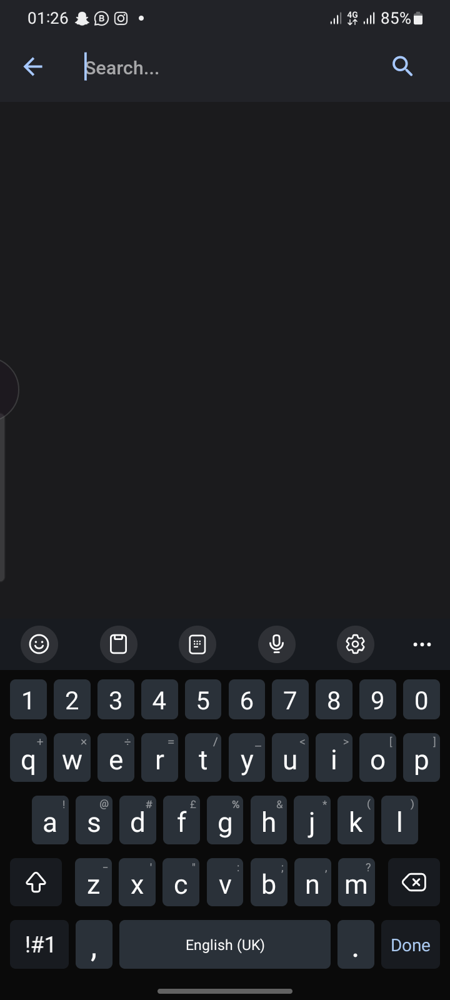
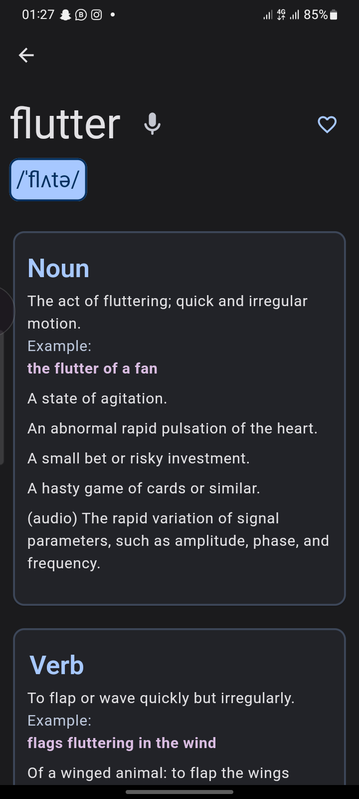
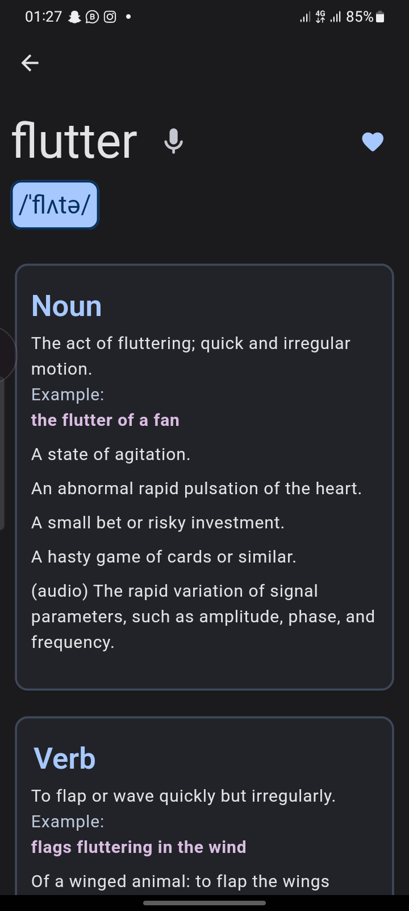
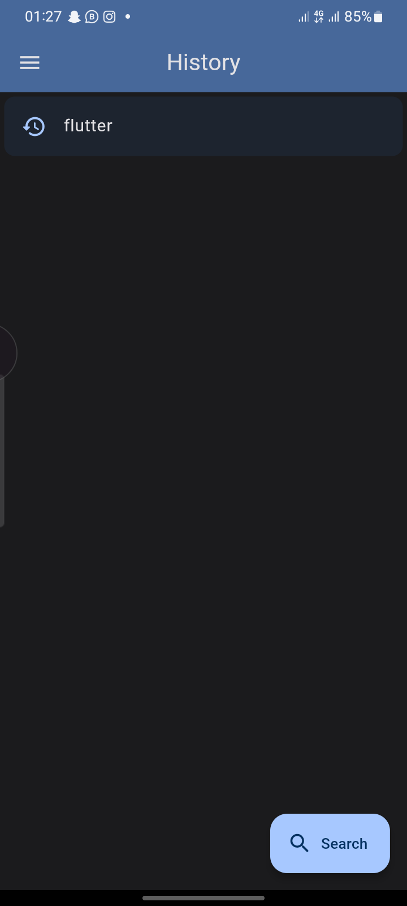

<h2> Wordy </h2>
<a href="https://drive.google.com/file/d/1RhcTrNGcGTxRhe_DdZBEGSoEFP1uevIM/view?usp=drive_link">
    
</a>

Wordy is a mobile application that allows users to search for word definitions, meanings, synonyms, and antonyms. It provides a simple and user-friendly interface to look up the meanings of words on the go.
Features

-   Word Search: Users can easily search for words using the search bar at the top of the app. As they type, the app will suggest auto-complete options to help them find the word they're looking for quickly.

-   Word Details: Once a word is selected from the search results, the app will display detailed information about the word, including its definition, pronunciation, example usage, synonyms, and antonyms.

-   Favorites: Users can mark words as favorites by tapping the heart icon next to the word details. Favorite words will be saved locally and can be accessed later for quick reference.

-   History: The app keeps a history of the user's search queries, allowing them to revisit their past searches and easily access previously searched words.

Screenshots
(Ignore my notifications 😅)





Screenshot 2

### Getting Started

#### You can either install it [here](./out/app-release.apk)

Or to run the app on your local machine, make sure you have the latest version of Flutter installed. Clone this repository, open the project in your preferred code editor, and run the following command in the terminal:

```bash
flutter run
```

Dependencies

The app relies on the following Flutter packages:

    http: Used to make HTTP requests to fetch word definitions from an external API.
    hive: Used to store favorite words locally on the device.
    providers: Used for state management

Contributions

Contributions to this project are welcome! If you find any issues or have ideas for improvements, feel free to open a new issue or submit a pull request.
License

The wordy was inspired by the need for a simple and efficient tool to look up word meanings and... that I don't have a dictionary app on my phone 😂. Thanks to the Flutter community for their excellent support and the developers of the open-source packages used in this project.
....

<h3 align="center">Thank You 👋</h3>
